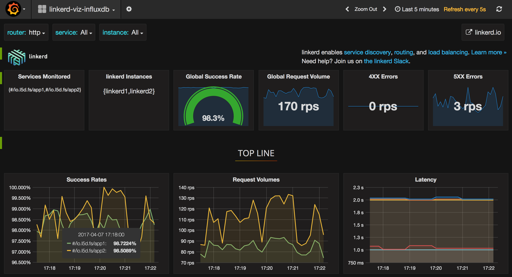

# InfluxDB

This directory contains a docker-compose environment that demonstrates a data
pipeline composed of slow_cooker, linkerd, Telegraf, InfluxDB, and Grafana.

## Startup

The [`docker-compose.yml`](docker-compose.yml) file that's included in this
directory is configured to run the demo. Start everything with:

```bash
$ docker-compose build && docker-compose up -d
```

That command will start [Grafana](https://grafana.com) on port 3000 on your
Docker host, which you can use to view the demo in action. Set the `DOCKER_IP`
environment variable to your Docker IP (e.g. `DOCKER_IP=localhost` for Docker
For Mac, or `DOCKER_IP=$(docker-machine ip)` for Docker Toolkit), and then open
the dashboard with:

```bash
$ open http://$DOCKER_IP:3000 # on OS X
```

It will look like this:



The Docker environment runs the following containers, listed in order of
front-to-back with respect to the data pipeline:

* **grafana**: A [Grafana](https://grafana.com/) instance, serving its UI on
port 3000, surfacing metrics from influxdb. The Docker environment also boots
a `grafana_bootstrap` container, to configure Grafana at runtime to connect to
InfluxDB

* **influxdb**: An [InfluxDB](https://influxdata.com/) instance, configuring to
receive metrics from Telegraf and serve metrics to Grafana.

* **telegraf**: An [Telegraf](https://github.com/influxdata/telegraf) instance,
configuring to collect metrics from each linkerd, and send them to influxdb.

* **apps**: Four app instances, grouped two each as app1 and app2. The app
service is defined in [`app.go`](app.go). The app service responds to HTTP
requests with the string "pong". Each app server is configured with varying
levels or latency and success rate.

* **linkerd**: Two linkerd instances, both configured to route requests to the
app services. The linkerd instances vary in the distribution of traffic between
app1 and app2, defined in their dtabs in [`linkerd1.yml`] and [`linkerd2.yml`].

* **slow_cooker**: Two [slow\_cooker](https://github.com/BuoyantIO/slow_cooker)
instances, slow_cooker1 and slow_cooker2, generate load on linkerd1 and
linkerd2, respectively. The slow_cooker instances vary in the amount of traffic
sent to their respective linkerd's.

## Troubleshooting

If you have any issues getting the demo up and running, pop into [linkerd's
Slack]( https://slack.linkerd.io) and we'll help you get it sorted out.

Thanks! 👋
